# **Creación de sitio web**

En esta sección estaré documentando las diferentes herramientas que utilice para crear el sitio web

## **Crear cuenta en GitHub** 

{ width=50 align=right}

Plataforma en línea que utiliza el sistema de control de versiones de Git 

## **Instalar y configurar Git en tu pc** 

{ width=50 align=right}

Sistema de control de versiones distribuido, gratuito y de código abierto.
Una vez instalado Git debemos abrir la terminal y asociar nuestra cuenta de GitHub,
los comando necesarios son

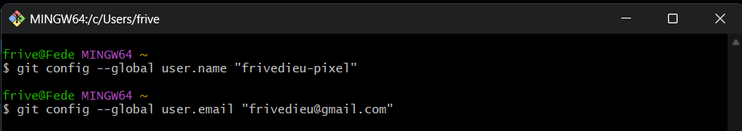
En mi caso utilice el nombre de usuario y mail asociado a mi cuenta GitHub

## **Generar una SSH Key en GitHub**

Permite conectar de forma segura tu computadora a GitHub

*Comando para generar claves: ssh-keygen -ted25519 -C "tu_email"* (este comando genera una clave pública y otra privada que nunca debes compartir!)

*Comando para ver tu clave: cat ~/.ssh/id_ed25519.pub*

*Comando para copiar clave: clip < ~/.shh/id_ed25519.pub*

## **Agregar tu SSH Key a GitHub**

Con esto terminaremos de asociar nuestra computadora a GitHub, pero algo importante: pegar clave pública y nunca la privada!!

*Settings - SSH and GPG keys - New SSH key - Add SSH key*

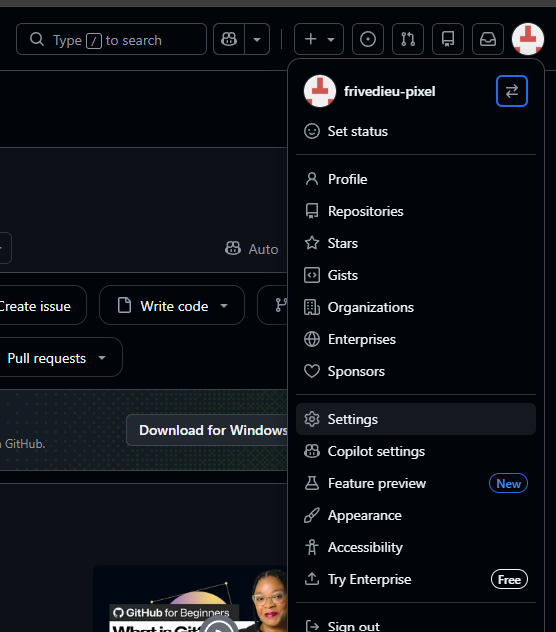

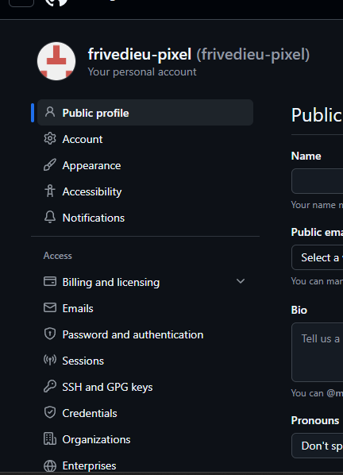

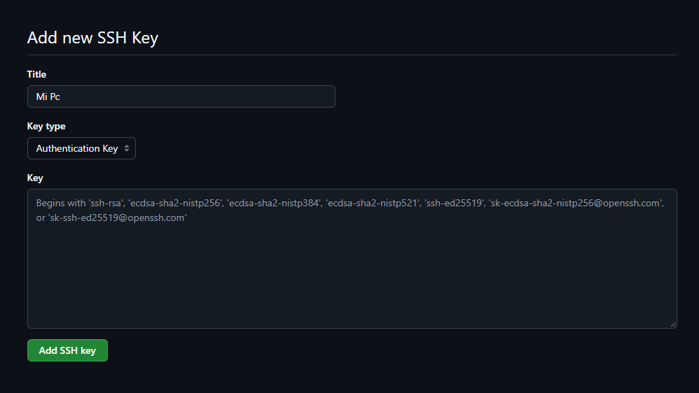

## **Fork**

Copia de un repositorio en GitHub que se crea dentro de tu propia cuenta. En nuestro caso se nos brinda un template creado para EFDI, será nuestro punto de partida Una vez dentro debemos hacer "click" en "Name: Github Repo"

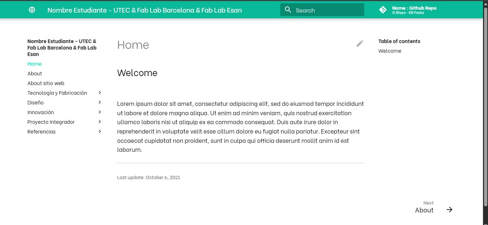 

Una vez dentro debemos hacer "click" en "Name: Github Repo", esto nos llevara a nuestra cuenta GitHub en donde debemos seleccionar "Fork" para crear nuestro nuevo repositorio

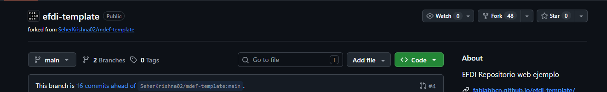 

## **Crear repositorio local en tu pc - clone**

Crear una copia local del proyecto que podrás editar, modificar y actualizar desde tu computadora. Antes de comenzar debemos dar permiso desde GitHub para que esto suceda, este paso es muy importante! Debemos entrar a la pestaña "Actions" y dar permiso.

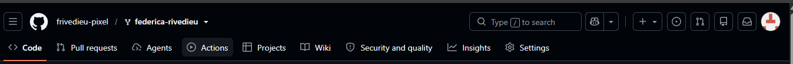 

Ahora podemos empezar a clonar pero antes debemos incorporar comandos que nos permitiran navegar dentro de nuestra terminar, esto es importante ya que debemos indicar en que carpeta queremos trabajar dentro de nuestra pc 

*cd nombre_carpeta (entrar en carpeta)*

*cd o cd ~ (ir a tu carpeta de inicio)*

*cd .. (subir de nivel de carpeta)*

*cd - (volver a carpeta anterior)*

*cd (entrar a carpeta)*

*ls (muestra los archivos dentro de la caprpeta donde estes ubicad@)*

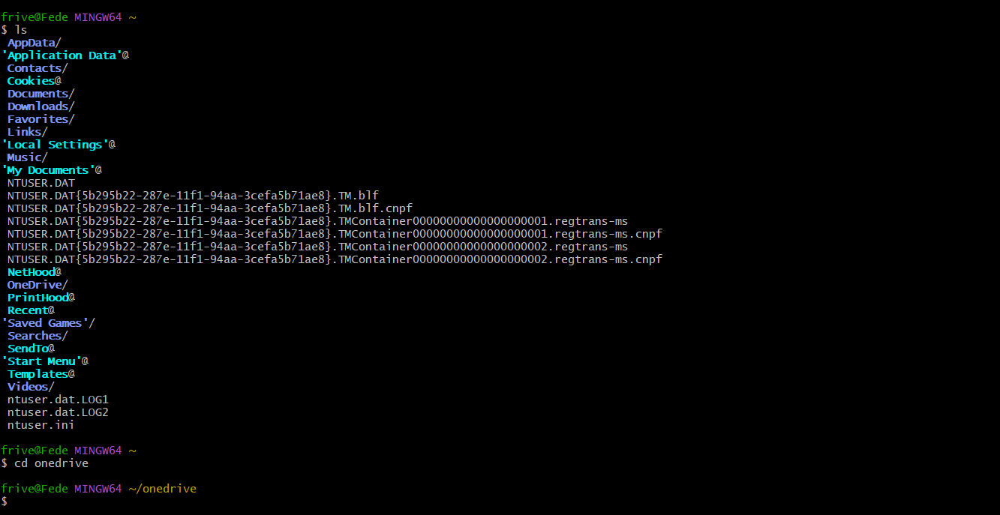 

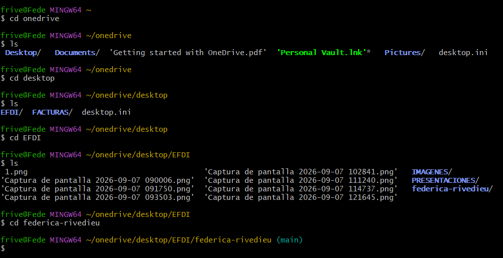 

Una vez dentro de la carpeta debemos escribir el comando que nos permitirá clonar el repositorio, debemos pegar nuestro URL que sacarmeos de GitGub copiando el link en la pesatña de SSH

*git clone URL_DEL_REPOSITORIO*

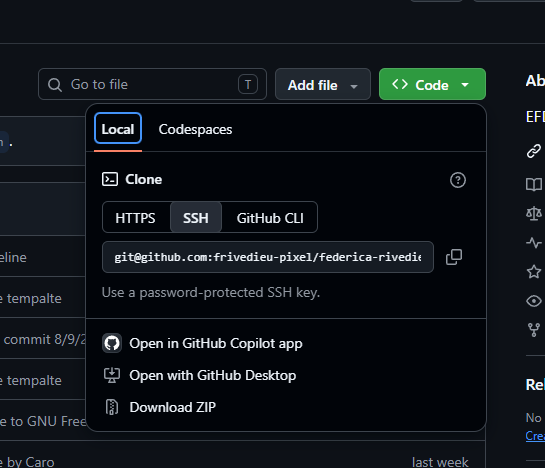

## **Plataformas para edición de desarrollo web**

Una vez clonado nuestro repositorio podremos comenzar a editar nuestra página web. En mi caso utilizaré "Visual Studio Code". El mismo es un editor de código que nos permite visualizar nuestra web, con sus diferentes secciones, pudiendo ir editando las mismas con la información, imágenes, links, etc, que nos parezcan pertinentes.

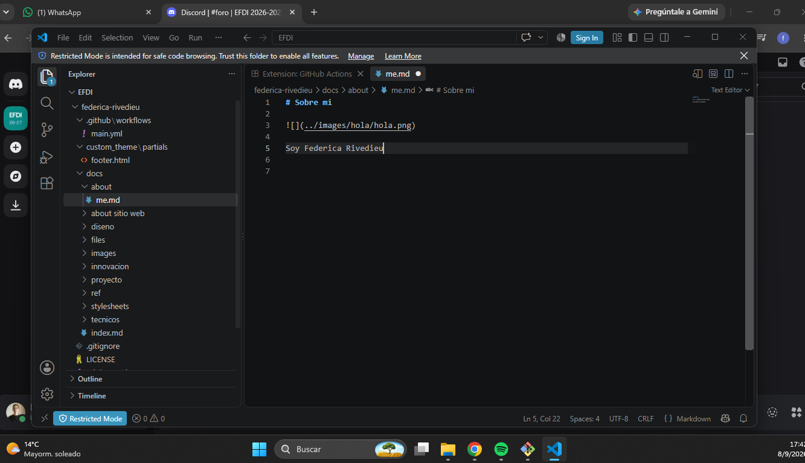

Además, mediante visual studio podremos trabajar local e ir actualizando nuestra página para ver los cambios que realizamos. Una vez que damos por finalizado podremos subirlo a nuestro servidor (GitHub) y guardar una nueva versión de nuestro archivo.

## **Conlcusiones**

Esta primera parte ha sido desafiante porque no tenía ningún conocimiento sobre la temática entonces tuve que incorporar un montón de información y términos nuevos, además de las diferentes plataformas y programas que utilizamos. 
Si bien parece un proceso continuo, ordenado, tuve varios errores antes de poder llegar al resultado final. Aca dejo algunas conclusiones con imagenes de referencia

[*Entender donde guardamos nuestros archivos*](../images/hola/error1.png){target="_blank"}

[*Volver a realizar pasos que quizás quedaron mal*](../images/hola/error2.png){target="_blank"}

## **Links** 

[*Sintaxis básica de escritura y formato*](https://docs.github.com/en/get-started/writing-on-github/getting-started-with-writing-and-formatting-on-github/basic-writing-and-formatting-syntax){target="_blank"}

[*Hoja de trucos para Markdown*](https://markdownguide.offshoot.io/cheat-sheet/){target="_blank"}

[*Material para MKDocs*](https://squidfunk.github.io/mkdocs-material/reference/){target="_blank"}

[*Logo Git*](https://git-scm.com/community/logos){target="_blank"}

[*Logo GitHub*](https://1000logos.net/github-logo/){target="_blank"}

[*Logo SSH Key*](https://www.abobwhite.com/ssh-keys-know-your-format/){target="_blank"}

[*Especialización en Fabricación Digital e Innovación*](https://utec.edu.uy/es/educacion/posgrado/especializacion-en-fabricacion-digital-e-innovacion/){target="_blank"}