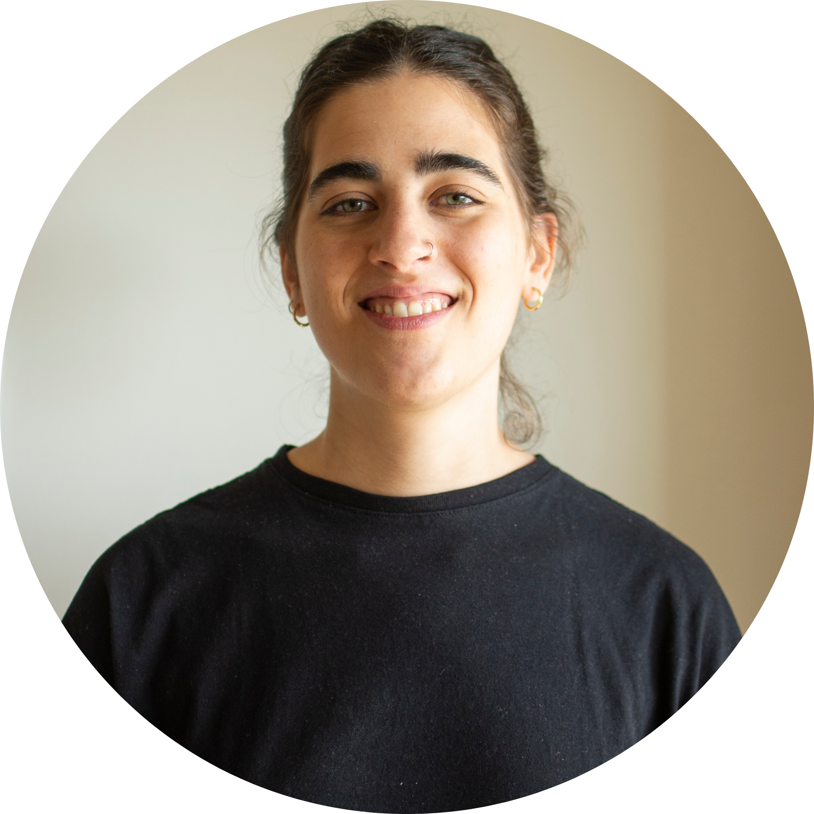

# **Federica Rivedieu**

{ width=300 align=right}

Licenciada en Diseño Industrial perfil producto, especializada en dibujo técnico y modelado 3D. Realicé mis estudios en la Escuela Universitaria Centro de Diseño (EUCD) integrante de la Facultad de Arquitectura, Diseño y Urbanismo (FADU) de la Universidad de la República (Udelar).

Desde hace varios años me especializo en modelado 3D y dibujo técnico en sectores industriales en Uruguay, como por ejemplo la industria cárnica y en la construcción. Esto me ha llevado a trabajar en equipos multidisciplinarios integrando áreas como la ingeniería mecánica, eléctrica, química, entre otros.

Mi interés por la fabricación digital nace a partir de dos proyectos en donde se busca implementar el uso de diferentes herramientas para un mejor desarrollo de producto (estos proyectos son en áreas diferentes a las mencionadas anteriormente).

* Participación en el proceso de diseño y desarrollo de producto (consola de sonido), donde utilizamos la impresión 3D para el prototipado.
* Diseño y desarrollo de mobiliario, explorando el vínculo entre materialidad, oficio y diseño contemporáneo, teniendo como objetivo poder optimizar parte del proceso por ejemplo utilizando CNC (Control Numérico Computarizado)

[Para mas información](../files/CV.pdf){target="_blank"}
