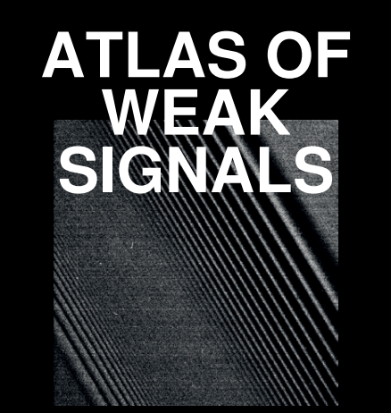
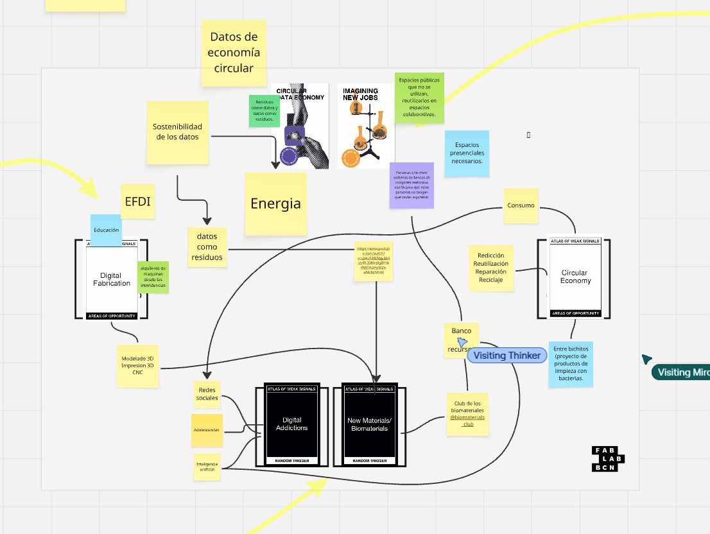

---
hide:
    - toc
---

# **Módulo de Diseño - Bloque 1**

Bienvenidos y bienvenidas al Eje de Diseño. En este bloque nos introducimos en el módulo de diseño: proyecto y contexto. Primero comenzaré mostrando las herramientas que me van a acompañar en este proceso. 

## **Miro**

{ width=250 align=right}

Herramienta digital en línea donde se comparte un espacio de trabajo para colaborar con otras personas en tiempo real. Es una especie de "pizarra virtual" 

## **Atlas of weak signals**

{ width=250 align=right}

Herramienta diseñada por Mariana Quintero con el objetivo de identificar "...señales débiles en un espacio práctico para comprender y analizar posibles escenarios emergentes basados ​​en las tendencias subyacentes de nuestro mundo actual." (Fab Lab Barcelona, 2022, *Atlas of weak signals*) 

La modalidad se trata de seleccionar diferentes cartas dentro de diferentes categorías de manera aleatoria o "al azar", armando nuestro tablero para comenzar a crear conexiones entre ellas. 

## **Primer clase MD01**

Entonces, utilizaremos *Miro* como espacio de trabajo para utilizar el *Atlas*. En esta primer clase nos dividimos en equipos para probar, jugar y compartir un primer acercamiento.

## **Canva personal**

Una vez seleccionadas las cartas a utilizar comenzaremos a exponer que nos despierta cada carta, que entendemos por cada una de ellas. Luego podremos empezar a identificar conexiones entre las mismas. Tendremos varias categorías de referencias a incluir dentro de los vínculos.

## **Links**

[*Logo Miro*](https://logolook.net/miro-logo/){target="_blank"}

[*Atlas of weak signals*](../files/MOD1/WeakSignals-.pdf){target="_blank"}

[*Manual Atlas of weak signals*](../files/MOD1/WeakSignals-manual.pdf){target="_blank"}

[*Fab Lab Barcelona*](https://fablabbcn.org/blog/emergent-ideas/atlas-of-weak-signals){target="_blank"}